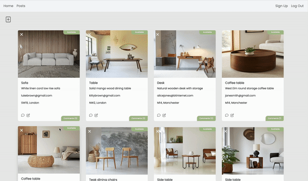
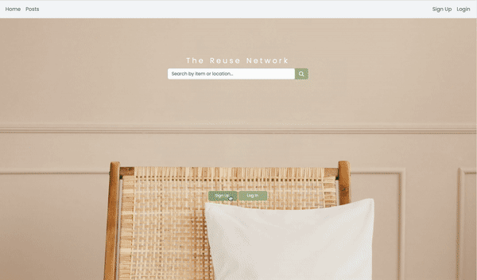
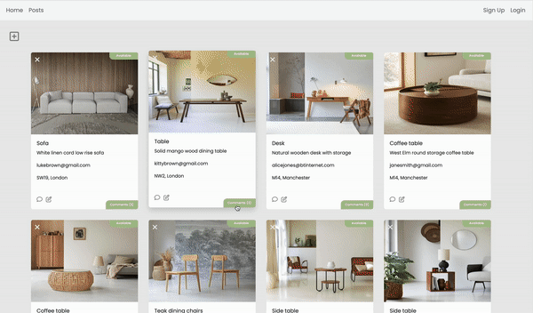

## SEI Project 4 The Reuse Network

For project 4, we were asked to build a full stack app with a Python backend and React frontend. I chose to develop an application called The Reuse Network that enables users to upload and browse posts about free furniture within their local area. Users have the option to sign up and log in, search for posts based on specific items or locations, explore all available posts, as well as create, modify, and remove their own posts. Additionally, users can engage in discussions by adding comments.

This repo contains the code for the front-end client only. You can find the code for the back-end API [here](https://github.com/lucyoswald/SEI-Project-4-Backend-Reuse-Network).

### Deployed Application

View the deployed site [here](https://the-reuse-network.netlify.app/).

Sign up and create new account or try this demo user:

- Username: lily@gmail.com
- Password: Straw1798!

## Application Visuals

<p align="center">







</p>

## Responsive Design

<p align="center">


</p>

## Project Brief:

- Build a full-stack application by making your own backend and your own front-end
- Use a Python Django API - using Django REST Framework to serve your data from a Postgres database
- Consume your API with a separate front-end built with React
- Be a complete product which most likely means multiple relationships and CRUD functionality for at least a couple of models
- Implement thoughtful user stories/wireframes that are significant enough to help you know which features are core MVP and which you can cut
- Have a visually impressive design to kick your portfolio up a notch and have something to wow future clients & employers
- Be deployed online so it's publicly accessible
- React Hooks is optional for this project

## 🛠 Technologies Used

Backend

- Python
- Django Rest Framework
- JSON Web Token (JWT)

Frontend

- React
- JavaScript
- React-Router-Dom
- Axios
- Bootstrap
- CSS
- SASS

Development and Deployment

- Excalidraw
- Postman
- Git
- GitHub
- Netlify
- Heroku

## Timeframe:

2 weeks | Solo project

## Planning

### Excalidraw

I started by mapping out each page and the components, working out how the pages would work together. I quickly determined the most important elements that were necessary for the initial version of the app (MVP). Then, I made a list of additional goals and nice-to-have features. I knew early on for example that I wanted to try and create modals for my application as it was something I didn’t get to do previously. So I mapped these out clearly and when they would appear via which button clicks. I really enjoy this part of the project, planning is so important but it really helps me start to visualise the app and also allows me to think how the code is going to start to look.


## Build/Code Process

### Backend:

This was my first time creating an application with a Python backend using Django, it was definitely a challenge but I really enjoyed it. I found once I got into the planning I was able to start thinking about what models I would need and how it would be structured. I have three models total, my posts model, comments model and then my jwt model.

### Post model

My post model lays out exactly what I wanted to display on each post: the image of the item, item name, the description, contact details for the poster and the location. The ‘status’ wasn’t a field necessarily on the card, it was so that when the user updates the card a little tab that is auto set to available can switch to pending, of course in order for this to update on the front end and save I had to make it a field in my backend.

```py
from django.db import models

class Post(models.Model):
    image = models.CharField(max_length=300)
    item = models.CharField(max_length=50)
    description = models.CharField(max_length=300)
    contact = models.CharField(max_length=50)
    location = models.CharField(max_length=50)
    status=models.CharField(max_length=20)

    owner = models.ForeignKey(
         'jwt_auth.User',
         related_name='posts',
         on_delete=models.CASCADE
    )


    def __str__(self):
         return f"{self.item} - {self.description}"

```

### Update, delete posts in the backend

This is the PostDetailView, which manages the functionalities for updating and deleting a post. I was particularly satisfied with the implementation of permission checks in these functions. It verifies whether the user attempting to update or delete the post is the actual owner, ensuring that only the owner can successfully perform these actions. Additionally, I successfully implemented an override for the admin, allowing them to update or delete posts regardless of their ownership status, achieved by incorporating the condition 'and not request.user.is_staff'.

```py
       class PostDetailView(APIView):
    permission_classes = (IsAuthenticatedOrReadOnly, )
    def get_post(self, pk):
        try:
            return Post.objects.get(pk=pk)
        except Post.DoesNotExist:
            raise NotFound(
                detail="Can not find an post with that primary key")
    def patch(self, request, pk):
        post_to_update = self.get_post(pk=pk)
           if request.user != post_to_update.owner and not request.user.is_staff:
               raise PermissionDenied()
        updated_post = PostSerializer(post_to_update, data=request.data)
        try:
            updated_post.is_valid()
            updated_post.save()
            return Response(updated_post.data, status=status.HTTP_202_ACCEPTED)
        except AssertionError as e:
            return Response({"detail": str(e)}, status=status.HTTP_422_UNPROCESSABLE_ENTITY)
        except:
            return Response({"detail": "Unprocessible Entity"}, status=status.HTTP_422_UNPROCESSABLE_ENTITY)

    def delete(self,  request , pk):
        post_to_delete = self.get_post(pk=pk)
        if request.user != post_to_delete.owner and not request.user.is_staff:
               raise PermissionDenied()
        post_to_delete.delete()
        return Response(status=status.HTTP_204_NO_CONTENT)


```

### Comments

My comments backend model was fairly straight forward, I just wanted the text, created_at and then of course the post that the comment was connected to.

```py
from django.db import models
class Comment(models.Model):
    text = models.TextField(max_length=300)
    created_at = models.DateTimeField(auto_now_add=True)
    post = models.ForeignKey(
        "posts.Post",
        related_name="comments",
        on_delete=models.CASCADE
    )
    owner = models.ForeignKey(
        "jwt_auth.User",
        on_delete=models.CASCADE
    ) def __str__(self):
         return f"{self.text} - {self.post}"

```

### Frontend

The website has a home page where the user can search for posts via item name or location. An all posts page that displays all the posts in the database. Users can click on a specific post to update or delete it, depending on their permissions and whether they are the original creator of the post. Additionally, users have the ability to leave comments on any given post and delete their own comments. Anyone can create a post as long as they’re logged in. I have a sign up and login page. Throughout the project, I have extensively utilized modals you can see this present for all my error pop ups and the CRUD functionality.

### Homepage

### Search Function

I have implemented a search functionality to allow users to find specific posts by item name or location. The main component representing the homepage is called Home. At the center of the page, there is a search input field where users can enter their search query. As they type, the search query is stored in the search state variable using the useState hook.

To initiate the search, users can click on the search button, which triggers the onSubmit function. This function handles the search submission process. First, it sets the loading state to indicate that the search is in progress. Then, it calls the fetchData function.

The fetchData function is responsible for making an API call to retrieve post data from a specific API endpoint. Using GET the data is received, it is then filtered based on the search query entered by the user. The filtering is done by checking if the item or location of each post includes the search query in a case-insensitive manner.

The filtered results are then stored in the searchResults state variable. If no results are found, a flag called unsuccessfulSearchSubmitted is set to true, which triggers the display of an error modal dialog. The modal informs the user that their search did not yield any results and provides a way to close the dialog.

```js

const Home = () => {
  const navigate = useNavigate();
  const [search, setSearch] = useState("");
  const [searchResults, setSearchResults] = useState([]);
  const [isLoading, setIsLoading] = useState(false);
  const [activeColor, setActiveColor] = useState(false);
  const [searchSubmitted, setSearchSubmitted] = useState(false);
  const [unsuccessfulSearchSubmitted, setUnsuccessfulSearchSubmitted] =
    useState(false);

  const fetchData = async () => {
    setIsLoading(true);
    try {
      const { data } = await axios.get(`${API_URL}/posts/`);
      console.log(data);
      const searchData = data;
      console.log(searchData);
      const filteredData = searchData.filter((item) => {
        return (
          item.item.toLowerCase().includes(search.toLowerCase()) ||
          item.location.toLowerCase().includes(search.toLowerCase())
        );
      });
      console.log(filteredData);
      setSearchResults(filteredData);
      setIsLoading(false);
      if (filteredData.length === 0) {
        setUnsuccessfulSearchSubmitted(true);
      }
    } catch (e) {
      setIsLoading(false);
      console.log(e);
      console.log("This isn't working");
    }
  };

  const onSubmit = () => {
    setActiveColor(true);
    setIsLoading(true);
    setSearchSubmitted(true);
    fetchData();
  };

```

```js
 //cut to the return

       <section className="postcards_onsearch">
              {searchResults.map((post) => (
                <PostCard key={post.id} post={post} />
              ))}{" "}
            </section>

        <Modal
        show={unsuccessfulSearchSubmitted}
        onHide={() => setUnsuccessfulSearchSubmitted(false)}
        style={{ marginTop: "25vh" }}
      >
        <Modal.Header closeButton></Modal.Header>
        <Modal.Body>
          Apologies the item or location you searched for isn't in our database
          yet.
        </Modal.Body>
        <Modal.Footer>
          <Button
            variant="secondary"
            onClick={() => setUnsuccessfulSearchSubmitted(false)}
          >
            Close
          </Button>
        </Modal.Footer>
      </Modal>
```

### Bootstrap Loading Visual

While the search is in progress, a loading visual component is displayed to provide feedback to the user. I integrated the loading visual via Bootstrap into my project, making minor CSS adjustments to match my colour scheme. It is used throughout the project to provide visual feedback during data fetching and search operations, ensuring a consistent user experience. Once the search results are available, they are rendered on the page using the PostCard component. Each post is displayed as a card, allowing users to view relevant information.

```js
<div className={!activeColor ? "home_search" : "grey_background"}>
        {isLoading ? (
          <div className="loading">
            <LoadingVisual />
          </div>
        ) : (
          <>
            {activeColor ? (
              <></>
            ) : (
              <video
                src={home_background_video}
                autoPlay
                loop
                muted
                className="home_background_image"
              />
            )}
```

### Navigate

Additionally, below the search section, there are sign-up and login buttons available; these both useNavigate() to navigate to their respective pages. However, if a search has been submitted, these buttons are hidden to avoid distracting the user. I also added a video for the background of this page. However, when users initiate a search by entering a query, the video transitions to a grey background. This change in background ensures that the posts, displayed as cards on the page, remain visually distinct and don't overwhelm the user.

```js
<section className="signup_login_buttons">
  {searchSubmitted ? null : (
    <>
      <button
        type="button"
        class="btn btn-primary"
        onClick={() => navigate("/signup")}
      >
        Sign Up
      </button>
      <button
        type="button"
        class="btn btn-primary"
        onClick={() => navigate("/login")}
      >
        Log In
      </button>
    </>
  )}
</section>
```

### PostCard component

The postcard component contains the card itself along with all the functionality available on the card. This includes updating the post, deleting the post, adding and deleting comments, and all of the not logged in error handlers.

### Icons & Overlays

To enhance the user experience, I integrated custom icons into the PostCard design. These icons are displayed for various actions, such as updating a post, deleting a post, commenting on a post, and deleting a comment. The inclusion of these icons serves as visual cues, providing users with clear indications of available actions.

To further enhance usability, I implemented tooltip overlays for each icon. These overlays provide descriptive information about the purpose and functionality of each icon. By incorporating these thoughtful design elements, I aimed to create an intuitive and user-friendly experience for users.

These carefully designed visual elements not only contribute to the overall aesthetics of the application but also play a vital role in improving its usability. Users can quickly identify and engage with the relevant icons, enabling them to perform actions such as updating post details with ease. Example of an overlay and icon implemented below.

```js
            <OverlayTrigger
              placement="top"
              overlay={
                <Tooltip id="edit-tooltip" style={{ fontSize: "10px" }}>
                  Click to edit
                </Tooltip>
              }
            >
              <FontAwesomeIcon
                icon={faPenToSquare}
                onClick={() => handleUpdateModal(true)}
                style={{ cursor: "pointer" }}
              />
            </OverlayTrigger>
          </div>
          <Card.Text style={{ fontSize: "13px" }}>{post.description}</Card.Text>
          <Card.Text style={{ fontSize: "13px" }}>{post.contact}</Card.Text>
          <Card.Text style={{ fontSize: "13px" }}>{post.location}</Card.Text>
        </Card.Body>
```

### Updating a Post and Changing Status

The edit icon, represented by a pen, serves as a clickable element for updating a post.
When the edit icon is clicked, a modal called the "Update Post" modal appears on the screen. This modal presents a form with pre-filled input fields that contain the current values of the post. Users can modify these values as desired.

Within the PostCard component, there is a function called onSubmit that handles the updating of a post, including the optional ability to change the status. This function is triggered when the user submits the update post form.

When the update post form is submitted, an asynchronous PATCH request is sent to the specified API endpoint ${API_URL}/posts/${id}/ using the axios.patch method. The id variable represents the unique identifier of the post being updated.

The request payload includes an object called patchFormData, which contains the updated values for the post's image, item, description, contact, location, owner, and status. These values are obtained from the form inputs and stored in the patchFormData state variable.

One of the fields in patchFormData is the status field, which represents the current status of the post. By default, the status is set to "Available". However, the user has the option to update the status by selecting a different value in the update form. Changing the status is entirely optional.

Upon successful submission of the PATCH request, the response data is captured in the updatePost variable. The theStatus state variable is updated with the value of patchFormData.status, reflecting the updated status of the post if the user chose to update it.

The appearance of the post card is affected by the status field. Initially, when the status is "Available", a green "Available" tab is displayed on the side of the card. However, if the user updated the status to a different value, such as "Pending", the tab color changes to an almond/amber shade, and the text on the tab changes accordingly. This visual change helps users quickly identify the availability or pending status of the item being shared.

This functionality allows users to update the details of a post, and if desired, change the status of the post to provide additional information about its availability or pending status. However, updating the status is entirely optional, and the post can be updated without modifying the status field as it is already preset to ‘Available’. See code below, to see the modal revert to my full code.

```js
  const [patchFormData, setPatchFormData] = useState({
    image: post.image,
    item: post.item,
    description: post.description,
    contact: post.contact,
    location: post.location,
    owner: post.owner.id,
    status: post.status,
  });
const onSubmit = async (e) => {
    e.preventDefault();

    try {
      const id = post.id;
      const token = localStorage.getItem("token");
      console.log(patchFormData);
      const updatePost = await axios.patch(
        `${API_URL}/posts/${id}/`,
        patchFormData,

        {
          headers: {
            Authorization: `Bearer ${token}`,
          },
        }
      );
      setTheStatus(patchFormData.status);
      setShowPostModal(false);
      setPatchFormData();
      location.reload();
    } catch (err) {
      console.log(err);
      console.log("This isn't working!");
    }
  };

  const onChange = (e) => {
    setPatchFormData({ ...patchFormData, [e.target.name]: e.target.value });
    console.log(patchFormData);
  };

  };
 useEffect(() => {
    setTheStatus(post.status);
  }, [post.status]);

```

### Deleting a post

To provide users with control over their posts, I implemented the ability to delete a post within the PostCard component. This feature allows users to remove their posts from the application.

Within the post card, there is a delete icon, which is displayed at the top-left corner of the card. This delete icon is visually represented by a times (X) symbol. Clicking on this delete icon triggers the deletion process.

When the delete icon is clicked, a delete confirmation modal pops up. This modal asks the user to confirm their intention to delete the post. It provides clear information regarding the deletion action and ensures that users do not accidentally delete their posts.

Within the delete confirmation modal, there are two options: "Cancel" and "Delete". Clicking "Cancel" dismisses the modal, allowing users to retain their post without any changes. Conversely, clicking "Delete" initiates the deletion process.

Upon clicking "Delete", an asynchronous DELETE request is sent to the specified API endpoint ${API_URL}/posts/${id}/ using the axios.delete method. The id variable corresponds to the unique identifier of the post to be deleted.

The request includes an authorization token to ensure that only the creator of the post can perform the deletion. This authentication mechanism prevents unauthorized users from deleting posts that do not belong to them.

If the deletion request is successful, the post is removed from the application, and the card representing that post is no longer displayed. This immediate removal ensures that the user interface remains up to date and reflects the changes accurately.

By implementing the delete post functionality, I aimed to empower users to have control over their own posts. This feature allows users to easily remove their posts when needed, providing a seamless and efficient experience within the application.
See my code below, including the delete modal.

```js
const deletePost = async (e) => {
  e.preventDefault();
  setShowDeleteModal(true);
  try {
    const id = post.id;
    const token = localStorage.getItem("token");
    const deletedPost = await axios.delete(`${API_URL}/posts/${id}/`, {
      headers: {
        Authorization: `Bearer ${token}`,
      },
    });
    location.reload();
  } catch (err) {
    console.log("this isn't working");
  }
};

<Modal
  show={showDeleteModal}
  onHide={() => setShowDeleteModal(false)}
  style={{ marginTop: "25vh" }}
>
  <Modal.Header closeButton>
    <Modal.Title>Delete Post</Modal.Title>
  </Modal.Header>
  <Modal.Body>Are you sure you want to delete this post?</Modal.Body>
  <Modal.Footer>
    <Button variant="secondary" onClick={() => setShowDeleteModal(false)}>
      Cancel
    </Button>
    <Button variant="danger" onClick={deletePost}>
      Delete
    </Button>
  </Modal.Footer>
</Modal>;
```

### Comments

Within the PostCard component, users have the ability to leave comments on a post. This feature allows users to engage in discussions and provide feedback or additional information related to the post.

To enable the creation of comments, I implemented a comment input field and a submit button within the Modal component. When users click on the comment icon displayed on the post card, a comment modal pops up, allowing them to enter their comment.

Once users have entered their comment, they can submit it by clicking the "Comment" button within the comment modal. Upon clicking the button, an onCommentSubmit function is triggered.

Inside the onCommentSubmit function, an asynchronous POST request is sent to the specified API endpoint ${API_URL}/comments/ using the axios.post method. The request includes the comment text entered by the user and the corresponding post ID to associate the comment with the specific post.

The POST request is sent with an authorization token obtained from the user's session to authenticate and authorize the comment creation. This ensures that only authenticated users can leave comments.

If the comment creation request is successful, the newly created comment is added to the existing comments list associated with the post. The UI updates to display the new comment, allowing users to view the latest contributions to the discussion.

In case of any errors during the comment creation process, appropriate error handling is implemented to handle exceptions and provide feedback to the user.

By incorporating the ability to create comments, I aimed to foster engagement and interaction among users within the application. This feature enables users to actively participate in discussions and share their thoughts on specific posts, promoting a dynamic and collaborative environment. Refer to my snippet below, and again refer to my code for use of the modal.

```js
const commentData = {
  text: "",
  post: post.id,
};

const [commentFormData, setCommentFormData] = useState(commentData);

const onCommentSubmit = async (e) => {
  e.preventDefault();
  console.log("its working");

  try {
    const token = localStorage.getItem("token");
    const createComment = await axios.post(
      `${API_URL}/comments/`,
      commentFormData,
      {
        headers: {
          Authorization: `Bearer ${token}`,
        },
      }
    );
    console.log(createComment);
    setComments((prevComments) => [...prevComments, createComment.data]);
    console.log(commentFormData);
    setShowCommentModal(false);
    setCommentFormData(commentData);
    location.reload();
  } catch (err) {
    console.log("This isn't working");
    console.log(err);
  }
};
const onCommentChange = (e) => {
  setCommentFormData({ ...commentFormData, [e.target.name]: e.target.value });
  console.log(commentFormData);
};
```

### CommentDropDown Component

In addition to the comment creation functionality, I implemented a separate component called CommentDropdown to display the existing comments associated with a post. This component provides users with visibility into the ongoing discussions and contributions on a specific post.

The CommentDropdown component takes the comments prop, which represents the list of comments for the post. It utilizes the React Bootstrap library to create a responsive and visually appealing modal for displaying the comments.

When users click on the "Comments'' button on the post card, the handleButtonClick function is triggered. This function sets the showModal state to true, opening the comment modal.

Within the comment modal, using .length() the number of comments is displayed in the title, giving users an overview of the comment count. The comments are rendered in a ListGroup component, providing a structured and organized format.

For each comment, the CommentDropdown component renders a ListGroup.Item element. It includes the comment owner's username, the comment text, and the timestamp of when the comment was posted. Additionally, there is a delete button represented by a cross symbol that allows users to remove their own comments.

Clicking on the delete button triggers the deleteComment function, which sends an asynchronous DELETE request to the specified API endpoint ${API_URL}/comments/${id}/ using the axios.delete method. The id value corresponds to the unique identifier of the comment to be deleted.

Similar to other operations that involve data modification, the DELETE request requires an authorization token obtained from the user's session to ensure proper authentication and authorization.

If the deletion request is successful, the comment is removed from the list of comments, and the UI is updated to reflect the changes.

Finally, the comment modal includes a "Close" button, allowing users to dismiss the modal and return to the post view.

```js
const CommentModal = ({ comments }) => {
  const [showModal, setShowModal] = useState(false);

  const handleModalClose = () => {
    setShowModal(false);
  };

  const handleButtonClick = () => {
    setShowModal(true);
  };

  const deleteComment = async (e) => {
    e.preventDefault();
    const id = e.target.value;
    console.log(id);
    try {
      const token = localStorage.getItem("token");
      const deletedComment = await axios.delete(`${API_URL}/comments/${id}/`, {
        headers: {
          Authorization: `Bearer ${token}`,
        },
      });
      location.reload();
    } catch (err) {
      console.log("this isn't working");
    }
  };

  return (
    <>
      <Button
        variant="primary"
        onClick={handleButtonClick}
        style={{
          fontSize: "9px",
          backgroundColor: "#a8c090",
          border: "none",
          position: "absolute",
          right: "0",
          bottom: "0.1px",
          borderTopRightRadius: "0px",
          borderBottomLeftRadius: "0px",
          borderTopLeftRadius: "10px",
        }}
      >
        Comments ({comments && comments.length})
      </Button>

      <Modal
        show={showModal}
        onHide={handleModalClose}
        style={{ marginTop: "25vh" }}
      >
        <Modal.Header closeButton>
          <Modal.Title style={{ fontSize: "20px" }}>
            Comments ({comments && comments.length})
          </Modal.Title>
        </Modal.Header>
        <Modal.Body>
          <ListGroup>
            {comments &&
              comments.map((comment) => (
                <ListGroup.Item key={comment.id}>
                  <button
                    style={{
                      position: "absolute",
                      top: 10,
                      right: 10,
                      backgroundColor: "transparent",
                      fontSize: "10px",
                      border: "none",
                      color: "red",
                    }}
                    value={comment.id}
                    // onClick={handleShowDeleteComment(true)}
                    onClick={deleteComment}
                  >
                    {" "}
                    ❌
                  </button>

                  <p>{comment.owner.username}</p>
                  <p>{comment.text}</p>
                  <p style={{ color: "blue" }}>
                    Posted:{" "}
                    {new Date(comment.created_at).toLocaleString("en-GB", {
                      hour: "2-digit",
                      minute: "2-digit",
                      day: "2-digit",
                      month: "short",
                      year: "numeric",
                    })}
                  </p>
                </ListGroup.Item>
              ))}
          </ListGroup>
        </Modal.Body>
        <Modal.Footer>
          <Button variant="secondary" onClick={handleModalClose}>
            Close
          </Button>
        </Modal.Footer>
      </Modal>
    </>
  );
};
export default CommentModal;
```

### Error handlers on the PostCard component

commentAlertModal: This modal is displayed when a user who is not logged in attempts to leave a comment on a post. It prompts the user to log in to leave a comment. The state commentAlertModal is used to control the visibility of this modal.
loginUpdateAlertModal: When a user who is not logged in attempts to update a post, this modal is shown. It informs the user that they need to be logged in to update a post. The state loginUpdateAlertModal controls the visibility of this modal.
loginDeleteAlertModal: Similar to the above case, this modal is displayed when a user who is not logged in tries to delete a post. It informs the user that they need to be logged in to delete a post. The state loginDeleteAlertModal is responsible for managing the visibility of this modal.

I also created a button that navigates the user to the login page, on all the ‘not logged in’ modal errors - I created this with useNavigate().

showAlertModal: If a user who is not the creator of a post tries to update it, this modal is shown. It informs the user that they can't update the post as they are not the creator. The state showAlertModal is used to control the visibility of this modal.
showDeleteAlertModal: When a user who is not the creator of a post attempts to delete it, this modal is displayed. It informs the user that they can't delete the post as they are not the creator. The state showDeleteAlertModal controls the visibility of this modal.

These error handlers are triggered in different scenarios to provide appropriate feedback and guidance to the user. They ensure that only logged-in users can perform certain actions such as leaving comments, updating posts, or deleting posts. Additionally, they prevent unauthorized users from modifying posts created by other users.

By implementing these error handlers and modals, I aimed to enhance the security and integrity of the application while providing clear instructions and notifications to users in different scenarios.

```js
const handleUpdateModal = (value) => {
  if (!userId) {
    // Show not logged in update modal
    setLoginUpdateAlertModal(true);
  } else if (userId === post.owner.id) {
    // Show update modal
    setShowPostModal(value);
  } else {
    // Show alert modal for not owner
    setShowAlertModal(true);
  }
};

const handleShowDeleteModal = (value) => {
  if (!userId) {
    // Show not logged in delete modal
    setLoginDeleteAlertModal(true);
  } else if (userId === post.owner.id) {
    // Show delete modal
    setShowDeleteModal(value);
  } else {
    // Show alert modal for not owner
    setShowDeleteAlertModal(true);
  }
};

const onCommentClick = () => {
  if (!userId) {
    setCommentAlertModal(true);
    return;
  }
  setShowCommentModal(true);
};
```

### Header component

I have implemented the header component for the application. The header is built using the Navbar component from React Bootstrap. I opted for this as it is mobile responsive and collapses with a clickable tab option when the screen gets smaller.

### Logged In / Logged Out

The authentication status is determined by checking the presence of a token in the local storage. If a token is present, the user is considered logged in, and the "Log Out" link is displayed. Clicking on the "Log Out" link triggers the handleLogout function, which removes the token from the local storage, updates the authentication status, and navigates the user back to the home page ("/").

```js
const Header = () => {
  const [isLoggedIn, setIsLoggedIn] = useState(localStorage.getItem("token"));
  const navigate = useNavigate();

  const handleLogout = () => {
    localStorage.removeItem("token");
    setIsLoggedIn(false);
    navigate("/");
  };

  const navigationLinks = [
    { title: "Home", slug: "/" },
    { title: "Posts", slug: "/posts" },
    { title: "Sign Up", slug: "/signup" },
    isLoggedIn
      ? { title: "Log Out", slug: "/", onClick: handleLogout }
      : { title: "Login", slug: "/login" },
  ];
```

### Posts component:

In this code snippet, I have implemented the Posts component, which is responsible for displaying a list of posts and providing the functionality to create new posts.

The Posts component starts by defining multiple state variables using the useState hook. These variables include posts to store the array of posts, showModal to control the visibility of the create post modal, isLoading to indicate if the data is being loaded, isLoggedIn to track the user's login status, and loggedInPostModal to control the visibility of the modal for logged-in users.

The component also uses the useEffect hook to fetch the list of posts from the API when the component mounts. If successful, the retrieved data is stored in the posts state variable, and the isLoading flag is set to false.

The create post functionality is implemented through a modal. I incorporated an icon for my create a post button, also implementing an animation effect so the icon appears to be bouncing. This animation is achieved by applying the bounce class to the FontAwesomeIcon component.

Clicking on the icon triggers the onClick function , which checks if the user is logged in by checking the presence of a token in the local storage. If the user is not logged in, the loggedInPostModal is displayed, prompting the user to log in. Otherwise, the showModal state variable is set to true, and the modal for creating a new post is shown. The form data for the new post is stored in the formData state variable, and changes in the form inputs are handled by the onChange function.

Submitting the form triggers the onSubmit function, which sends a POST request to the API endpoint to create a new post. The request includes the form data and the authorization token retrieved from the local storage. If the request is successful, the newly created post is added to the posts state variable, the showModal state variable is set to false to close the modal, and the formData state variable is reset to its initial values.

The list of posts is then rendered using the map function on the posts array. Each post is rendered as a PostCard component. Additionally, the loading visual component is displayed when the data is being fetched, and a modal to prompt the user to log in when attempting to create a post without being logged in. See the code below - to review the full solution refer to the Posts page in my files.

```js
const Posts = () => {
  const [posts, setPosts] = useState([]);
  const [showModal, setShowModal] = useState(false);
  const [isLoading, setIsLoading] = useState(true);
  const [isLoggedIn, setIsLoggedIn] = useState(false);
  const [loggedInPostModal, setLoggedInPostModal] = useState(false);

  const navigate = useNavigate();

  useEffect(() => {
    const fetchData = async () => {
      try {
        const { data } = await axios.get(`${API_URL}/posts/`);
        setPosts(data);
        setIsLoading(false);
      } catch (e) {
        setIsLoading(false);
        console.log("This is not working!");
      }
    };
    fetchData();
  }, []);

  const initialFormData = {
    image: "",
    item: "",
    description: "",
    contact: "",
    location: "",
    status: "Available",
  };

  const [formData, setFormData] = useState(initialFormData);

  const onChange = (e) => {
    setFormData({ ...formData, [e.target.name]: e.target.value });
    console.log(formData);
  };

  const onClick = () => {
    const isLoggedIn = localStorage.getItem("token") !== null;

    if (!isLoggedIn) {
      setLoggedInPostModal(true);
    } else {
      setShowModal(true);
      setFormData(initialFormData);
    }
  };

  const onSubmit = async (e) => {
    e.preventDefault();

    try {
      const token = localStorage.getItem("token");
      const createPost = await axios.post(`${API_URL}/posts/`, formData, {
        headers: {
          Authorization: `Bearer ${token}`,
        },
      });
      console.log(createPost);
      setPosts((prevPosts) => [...prevPosts, createPost.data]);
      setShowModal(false);
      setFormData(initialFormData);
    } catch (err) {
      console.log("This isn't working");
      console.log(err);
    }
  };

```

## Wins & Challenges

### Wins:

- Despite the limited time we had to learn Python, I consider this project a success. Towards the end, I gained a better understanding of the backend concepts, and things started to fall into place more smoothly, which was satisfying.
- One of my biggest accomplishments was being able to bring my vision to life. I set out with a clear goal in mind, and I'm proud to say that the product I created closely aligns with that vision. It's fulfilling to see the project turn out exactly as intended.
- Overall, I'm highly satisfied with the overall appearance of the application. It is fully responsive and optimised for mobile devices. Incorporating mobile responsiveness was crucial, and I'm delighted that I was able to achieve this important aspect.

### Challenges:

- Undoubtedly, this project presented several challenges. Despite gaining more confidence in Python, I still found it to be a relatively unfamiliar territory, and determining the necessary backend components for the project's success proved to be a challenging starting point.
- A specific challenge I encountered was implementing modals, which I utilized for the first time throughout the project. Integrating modals, especially with Bootstrap, proved to be an arduous task. While Bootstrap has its advantages, I found it less flexible and encountered difficulties working with its predefined styles and functions. It often became a source of frustration and required additional effort to achieve the desired outcome.

### Key Learnings

One key learning was the importance of focusing on the MVP and avoiding the temptation to incorporate every possible feature. By prioritizing the essential functionalities, I was able to maintain a clear direction and deliver a functional product.
Another significant learning experience was the need to approach the Python backend slowly, taking the time to process and analyze the backend requirements before rushing forward.

### Future Improvements

- An area for future improvement is my code organization and legibility. I faced challenges with code destructuring, specifically in the modals used in the PostCard and Posts components. Due to time constraints, I was unable to implement proper destructuring. I would like to invest more time into this to enhance the readability of my codebase.
- Additionally, I had a vision for a "profiles" page that would allow users to create profiles and offer their services to the community, similar to the functionality of the posts page.
